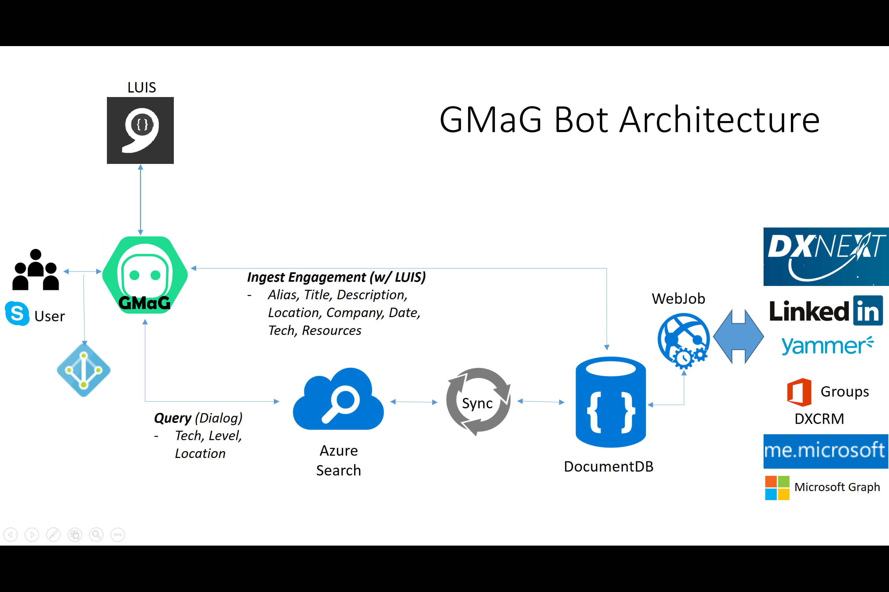

# GetMeAGuruBot

GMaG is a bot to solve our TE problems - find people who have experience across the globe. You can add engagements, and query for results using interactive cards. Future plans are to connect with DXNext, LinkedIn, and Microsoft Graph for even more functionality and information. See the deck at the GitHub repo for more details and an architecture diagram.

Technologies used: Azure Search, Bot Framework (Conversations Platform), Document DB, LUIS (Cognitive Services), CI/CD with Visual Studio Team Services, GitHub.

Add GMaG to your Skype here: http://aka.ms/AddGMaG

[Slide deck with more details!](GetMeAGuru.pptx)

